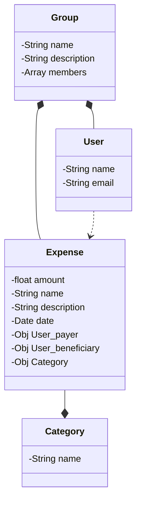

# .files

This repo is about my dotfiles. 

This is made for Ubuntu Linux distribution but it can be also used on other Unix based systems.

## Install

On your fresh Ubuntu Linux installation:

Install git:

```
sudo apt -y install git
```

Clone the repository:

```
git clone https://github.com/qroques/dotfiles ~/dotfiles
```

Magic install:

```
make install
```

## Credits

This is an adaptation of [lcouellan](https://github.com/lcouellan/) [dotfiles project](https://github.com/lcouellan/dotfiles)

